Sometimes, despite having all the pieces in place and doing everything right, success seems elusive. It's often a game of patience. Hard work is undoubtedly a significant factor in achieving success, but there's another crucial element at play – timing. It's about being in the right place at the right moment, seizing opportunities as they arise, and connecting with others at just the right time.

Movies reflect this aspect of life brilliantly. The impact of a film on us depends not just on its content, but also on when we watch it. The right movie at the right time can make us laugh, cry, or reflect. It's a personal experience, unique to each viewer.

But let's zoom out from the individual experience to the broader perspective of the movie industry. Have you ever considered how the timing of a movie release might be a key to its success? In our story, 'Is Timing Everything?', we delve into the CBU movie dataset to explore this fascinating aspect. We'll look at how the release dates of movies influence their success and reception. So, whether you're a film lover, a data geek, or just someone intrigued by the behind-the-scenes of the movie world, join us. We'll dive into patterns, make predictions, and maybe even unearth some insights useful for filmmakers and the movie industry. Life is often about luck, but what if you could sway it in your favor? What if you knew exactly how to time the release of your masterpiece? Ready to make yourself lucky? Let's begin: Action!

_______________________________________________________________

# Release Dates and Movie Genres - Orchestrating the Perfect Season (Question 1)

Let's dive into the intriguing interplay between movie genres and their release calendars. Are horror films naturally drawn to Halloween? Do summer months exclusively belong to action-packed blockbusters? In this part of our story, we'll try to see if there are any recurring patterns between a film's genre and its release timing within a year. Do these rhythms exist, and if so, do they change depending on where the movie is released? This exploration isn't just about identifying patterns; it's about understanding whether these insights can help us predict the genre of upcoming film releases in different seasons. It's time to discover if there's a secret rhythm dictating when different genres of movies make their grand entrance on the big screen.

## 1.1 Exploration

For this analysis, we will focus on the film genres, the release period of the year, and the locations where they are released.
We will also investigate patterns that may exist between the time of year and the number of film releases.

### 1.1.2. Annual periodicity and film genres
Let's investigate the possible existence of a correlation between annual periodicity and film genres. It is also relevant to examine the existence of trends that are not dependent on the film genre or location. To provide us with an initial idea, we compute the monthly average of films released, considering all genres and locations. This gives us an overview of the distribution of film releases throughout the seasons.

<!--
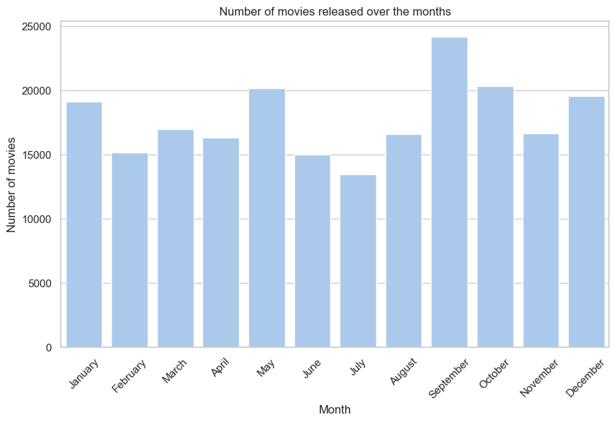
-->
<iframe src="assets/plot/1_monthly_movie_count.html" width="750px" height="530px" frameborder="0" position="relative">Genre plot</iframe>

This bar chart allows us to conclude that the distribution of films throughout the year is not uniform; for instance, the summer months appear to have fewer releases than others. Therefore, it is necessary to differentiate, for each genre, whether the trend is driven by the overall distribution of films throughout the year or if it is specific to certain film genres.

### 1.1.3. Repartition of the main genre
In our dataset, we have a wide variety of genres represented.  For now, we will focus on the five most represented genres in the dataset.
Let's observe the representation of film genres in our resulting dataset.

<!--
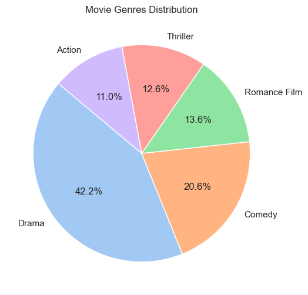 
-->

<iframe src="assets/plot/1_movie_genre_dist_pie.html" width="750px" height="530px" frameborder="0" position="relative">Genre plot</iframe>

The 'drama' genre predominates significantly, while the other genres are fairly balanced among themselves.Now, we will examine the distribution of films across months based on their genres.

### 1.1.4. Repartition of the continent

In our dataset, we have a wide range of countries represented. To study the link between location and the distribution of release months, we will group these countries by their continents.

<!--
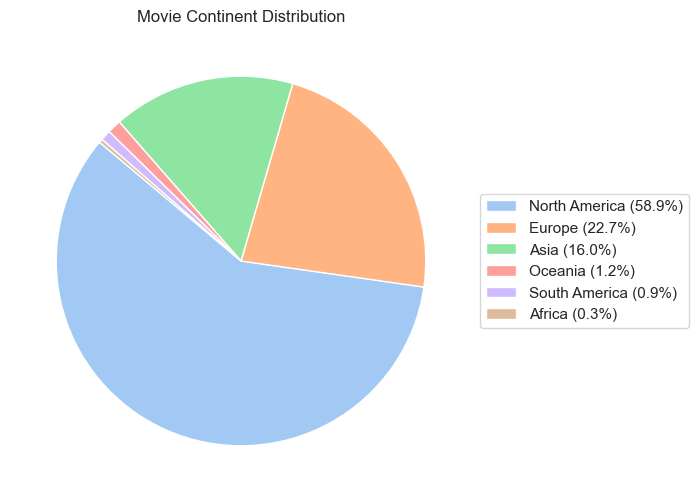 
-->
<iframe src="assets/plot/1_movie_dist_continent_pie.html" width="750px" height="530px" frameborder="0" position="relative">Genre plot</iframe>

The pie chart shows us the proportion of each continent in our dataset. We observe that three continents represent almost the entirety of our dataset, so we will focus on these.

### 1.1.5. Setting a Threshold for Data Inclusion

Before continuing, it is important to take into account and important factor, the distribution of the number of data by year.

<iframe src="assets/plot/1_histo_counts_release.html" width="750px" height="530px" frameborder="0" position="relative">Genre plot</iframe>

This histogram displays the distribution of the number of films released each year, regardless of their genre or release location. We observe a significant increase over the years. To maintain the relevance of our analysis, we have established a threshold of 200 films per year as a selection criterion for the years to be included in our study. After applying this criterion, we selected the most recent year that did not meet it and then excluded all data prior to that date. This approach ensures that our dataset remains statistically relevant and consistent over time.

Furthermore, upon examining this graph, we notice that after 2009, the number of films decreases significantly in the dataset. This trend appears counterintuitive and may be attributed to the difficulty of obtaining recent data (the dataset was published in 2012). To avoid potential data bias, we are focusing on data up to the year 2009.

## 1.2. Comprehensive Seasonality Analysis Across All Genres and Locations

Let's now investigate the possibility of seasonality in film releases, regardless of genre or location, over time. 

### 1.2.1. Monthly Cinematic Release Dynamics: Histogram Analysis of Release Rates

We conduct a thorough analysis with the aim of predicting the percentage of films released each year during a specific month.

<!--
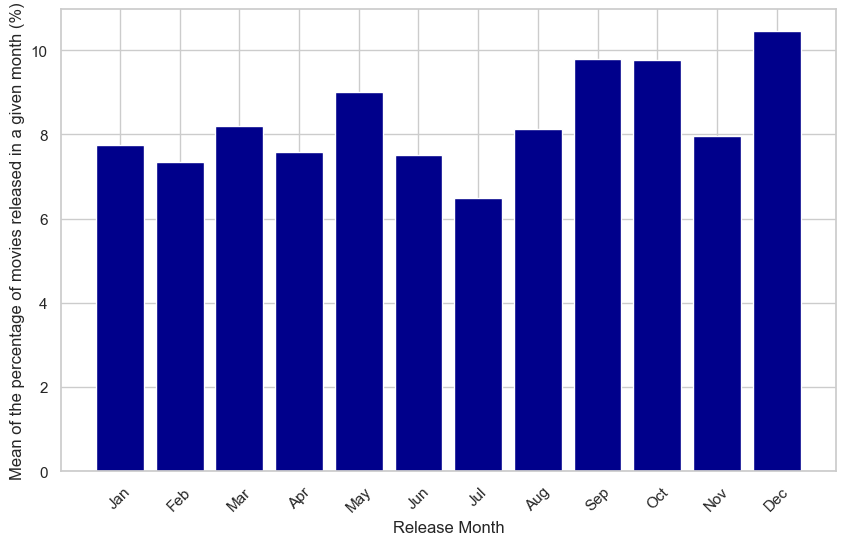 
-->

<iframe src="assets/plot/1_mean_percent_release_month_histo.html" width="750px" height="530px" frameborder="0" position="relative">Genre plot</iframe>

Upon examining this plot, we observe that the percentage of film releases per month is not evenly distributed throughout the year. This leads us to increasingly consider the hypothesis that there may be seasonality in film releases over the course of the year. However, we must exercise caution with this type of analysis because it's possible that if there is any seasonality in film releases, it may not have been consistent over time. For example, there might have been a pattern in the last 10 years, such as fewer film releases in July, but this may not have been the case in earlier years.

To investigate this further, we will utilize the Canova Hansen Test.

### 1.2.2. Seasonal Pattern Stability: Canova-Hansen Tests on Time Series Data

In the Canova-Hansen test, the 'm' parameter represents the data's seasonal period, for example, 12 for monthly data and 4 for quarterly data. A result of 'D = 1' indicates the need for seasonal differentiation to stabilize the seasonal pattern, suggesting variable seasonality in the data.

The result of our Canova-Hansen Test is **1** which reveals that the seasonal patterns in our data are not constant over the analyzed period. To deepen our understanding, we will calculate the autocorrelation of our data at various time lags. This analysis will enable us to determine how long a specific seasonal pattern persists in our dataset, providing more precise insights into the underlying temporal dynamics and the persistence of seasonal trends.

### 1.2.3. Analysis of Seasonal Pattern Persistence : Autocorrelogramme

An autocorrelation plot, or autocorrelogram, is a vital tool in time series analysis, used for visualizing and measuring autocorrelation, i.e., the relationship between a time series and its past values at different lags.

**Interpretation**
- **Significant Peaks**: A peak in the autocorrelogram at a specific lag indicates significant autocorrelation at that lag. Peaks beyond the confidence bounds suggest statistically significant autocorrelation.

- **Seasonality and Temporal Dependence**: Regular peaks at multiples of a specific period indicate seasonality. For example, annual peaks in monthly data would appear every 12 months, revealing a yearly seasonal trend.
<!--
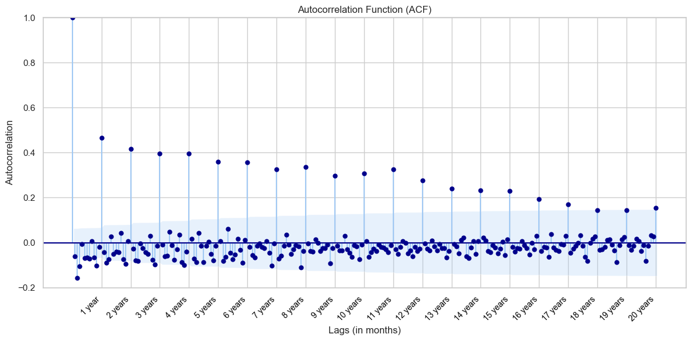 
-->
<iframe src="assets/plot/1_autocorrelation_graph.html" width="750px" height="530px" frameborder="0" position="relative">Genre plot</iframe>

#### Analysis of the Autocorrelation plot:

1. **Initial Peak**: The first lag exhibits a peak close to 1, which is expected as it represents the correlation of the series with itself.

2. **Subsequent Lags**: Several spikes are observed that exceed the blue shaded area, indicating statistical significance. These prominent peaks suggest significant autocorrelation at those lags.

3. **Seasonal Patterns**: Notable peaks appear at regular intervals of 12 months (1 year) and persist beyond the confidence intervals up to a lag of 17 years. This implies two important findings: 

   - The significant spikes at lags corresponding to multiples of 12 months (1 year, 2 years, etc.) suggest a strong and consistent annual seasonality in the data.
   
   - The presence of these significant peaks at regular intervals, especially up to a lag of 17 years, indicates that the seasonal effect is not only strong but also has a long-term influence on the series. This suggests that past values, not just from the previous year but several years back, influence the current values.

**Conclusion**: We can assert two key findings: there is an annual seasonality in our data, as evidenced by the significant peaks occurring every 12 months in our autocorrelation plot. Furthermore, it seems that the seasonal effect has a long-term impact on the years, exhibiting significant correlations up to 17 years later.
Additionally, the fact that this autocorrelation is no longer significant after 17 years provides us with additional information: seasonality has evolved over time, aligning with the implications of the Canova-Hansen Test result.

### 1.2.4. Decoding Trends and Seasonality: Seasonality Visualization

Now that we know that seasonality has changed over time and that patterns tend to change approximately every 17 years, we will attempt to visualize these differences. To do so, we extract two datasets from our data. The first contains the most recent 17 years [1993, 2009], and the second the preceding 17 years [1976, 1992]. Subsequently, we conduct a Canova-Hansen test to ensure that among these datasets, the seasonal motif remains stable.

The result of the Canova-Hansen Test for the the past years is 0, and that is also true for the recent years.

Great! Now that we've ensured this pattern is stable, we'll attempt to extract the seasonality from our two different datasets. To do this, we'll use the highly useful function `seasonal_decompose` from `statsmodels`. This function allows us to decompose our time series into three components:

**The trend component** outlines the long-term direction of movie release data, smoothing out temporary changes and showing if the industry is growing, shrinking, or holding steady. In our multiplicative model, this trend's influence may vary at different data levels.

**The seasonal component** detects recurring patterns within set timeframes, like annual cycles in monthly data, indicating when releases typically spike or dip. This effect scales with the data, meaning it can make the natural highs and lows more pronounced if the overall trend is rising.

**The residual component** is what's left unexplained after accounting for trend and seasonality, representing random variations. In this model, residuals are calculated by dividing the data by both trend and seasonal factors. Significant residuals might suggest unusual events impacting movie releases that the model doesn't otherwise account for.
<!--
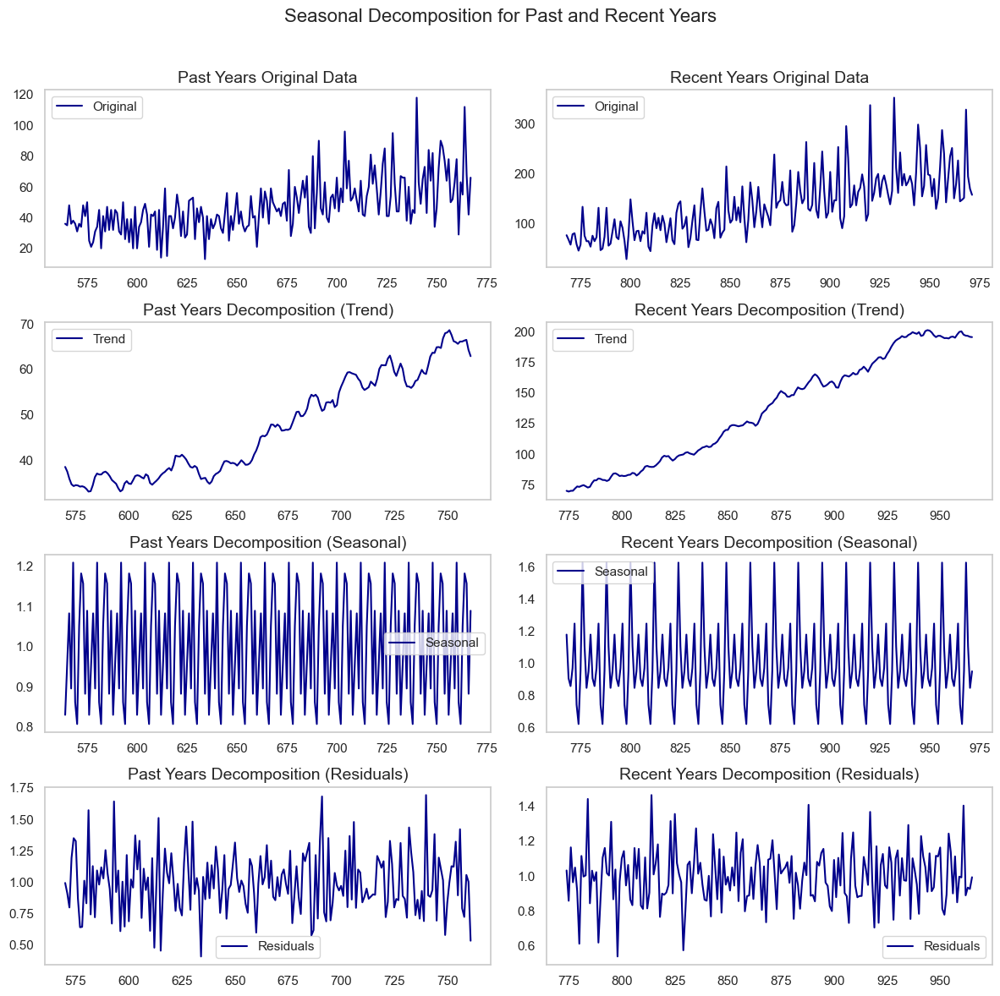
-->
<iframe src="assets/plot/1_season_decomposition.html" width="750px" height="530px" frameborder="0" position="relative">Genre plot</iframe>
Without surprise, we observe that the overall trend increases for both the movies from [1976-1992] and those from [1993-2009]. We also notice that the seasonal patterns are different. Let's try to visualize them in more detail.

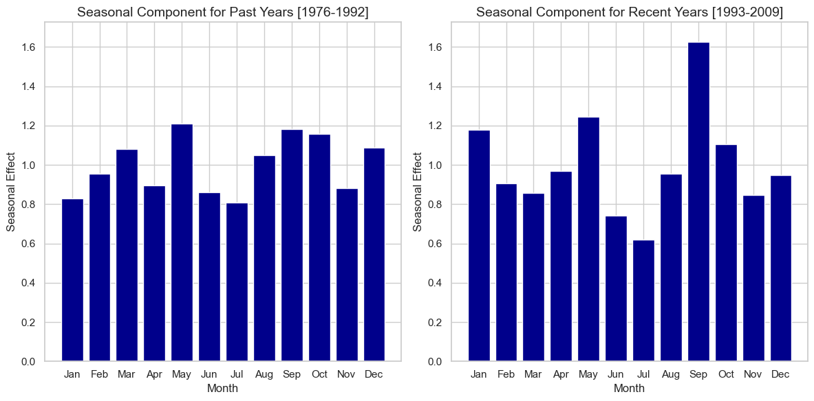

Indeed, we observe that the seasonal patterns have changed between these two periods. The more recent period seems to exhibit more pronounced differences among the months of the year compared to the previous period. For instance, in the most recent period, the month of July has a multiplicative factor relative to the trend of about 0.6, while in the past period, it was 0.8. On the other hand, the month of September is well above the general trend in the most recent period, at 1.6 times the trend, whereas in the past period, it was only 1.2.

In conclusion, it's fascinating to observe how seasonal patterns evolve over time. We notice significant differences. The most recent period in our dataset appears to exhibit more pronounced variations than before, suggesting that these month-to-month differences seem to intensify over time.

## 1.3. Detailed Study by Genre and Location

In this section, we will examine whether there are differences in seasonality between film genres and locations. To do this, we will work exclusively with data from the ten most recent years in our dataset.

### 1.3.1. Monthly Cinematic Release Dynamics: Histogram Analysis of Release Months depending on Genre and Location

In this section, we explore the potential presence of seasonality in film releases, considering both genre and location, across time. To do so, we will perform a similar analysis to that in Section 2.1, while distinctly separating genres and locations.

TABLE

INTERRACTIVE PLOT

### 1.3.2. Seasonal Stability Diagnostics: Canova-Hansen Testing by Category and Region

TABLE 

It appears that the seasonal patterns within genres and locations remain stable throughout the selected period [1993-2009]. It's worth noting that this period was initially chosen in section 2.3 because the seasonal patterns, encompassing all genres and locations, were stable during that time. This latest analysis simply demonstrates that when we subdivide our dataset by genre and location, any intrinsic patterns within these subdatasets also remain consistent over the same period.

### 1.3.2. Seasonal Stability Diagnostics: Canova-Hansen Testing by Category and Region
To further delve into this analysis, we will calculate autocorrelation, as done in section 2.3. However, this time, we will separate the film genres and continents.

TABLE

It appears that the seasonal patterns within genres and locations remain stable throughout the selected period [1993-2009]. It's worth noting that this period was initially chosen in section 2.3 because the seasonal patterns, encompassing all genres and locations, were stable during that time. This latest analysis simply demonstrates that when we subdivide our dataset by genre and location, any intrinsic patterns within these subdatasets also remain consistent over the same period.

To further delve into this analysis, we will calculate autocorrelation, as done in section 2.3. However, this time, we will separate the film genres and continents.

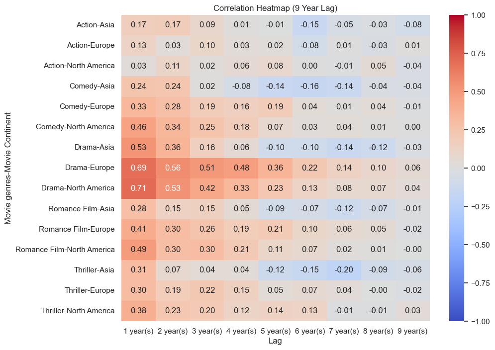

The heatmap analysis uncovers intriguing patterns in movie release timing, showing that the predictability of release patterns varies by genre and region. For example, action movies in North America do not show a consistent annual pattern, suggesting their release timings are varied year to year.

On the other hand, dramas, especially in Europe and North America, have a strong and consistent annual release pattern that can persist for up to four years, indicating a predictable seasonal trend in these regions.

Overall, Asia displays the least predictability in movie release patterns, while Europe and North America exhibit more consistency according to genre. The analysis also highlights that while some genres follow strong seasonal trends, others show no such regularity.

### 1.3.3. Decoding Trends and Seasonality : by Genre Category and Region

Similarly to the analysis conducted in point 2, we now focus on examining the seasonal multiplicative factors. The objective here is to highlight, for genres and locations exhibiting seasonal patterns as identified in point 3.2, the months that stand out from the general trend and contribute to the formation of these patterns.

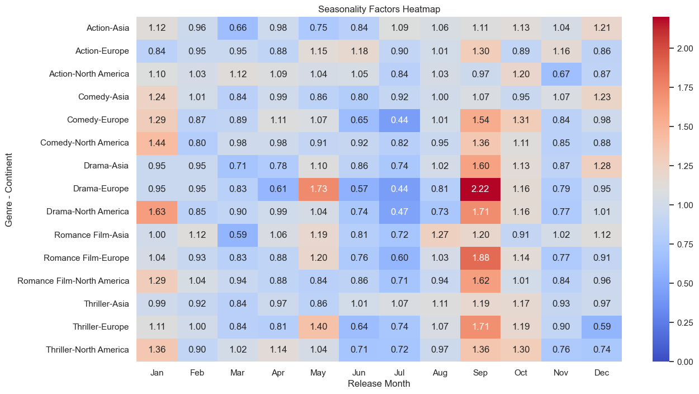

The drama genre presents a fascinating case study. While it shows an overall annual seasonality, a closer look reveals distinct regional differences. In Europe, May stands out as a popular month for drama releases, with a significant uptick compared to the average, while this month is not as prominent for drama releases in North America. Conversely, January is more significant for drama releases in North America than in Europe.

Both regions, however, see a surge in drama releases during June and July and a dip in September. This analysis confirms that while annual seasonal patterns do exist for certain genres and locations, they also display unique regional variations.

## Transition :

As our data story unfolds, it's clear that certain movie genres do have their preferred release times. But why? While it's straightforward for Christmas and Halloween movies, other genres aren't as clear-cut. Perhaps production companies are tuning into the public's mood, providing just the right kind of film at just the right time. Or maybe, they've learned from experience that release timing can significantly influence a film's success. After all, isn't that a key goal for them - to make their movies as successful as possible? But here's a thought - what exactly defines success in the film industry? Is it the accolades from peers or the applause from the audience? Well, it's time to explore both. To satisfy the film aficionados among us, let's first dive into how the release calendar impacts the most prestigious accolade in the movie world – the Oscar.

_______________________________________________________________

# Setting Your Watch for the Red Carpet - How Timing Influences Oscar Success (Question 2)

Now, as we roll out the red carpet, it's time to see how timing influences a movie's journey to Oscar glory. Is there a 'golden month' for releasing a film that could increase its chances of capturing that coveted golden statue? In this part of our exploration, we will try to see which factors impact a movie's success, especially in terms of its likelihood to win an Oscar. Does release timing play a crucial role, and has its effect evolved over time? We're also going to delve into whether it's possible to predict a film's Oscar odds based on various factors, including its release month, the country of origin, language, and more. Let's discover the intricate dance between the calendar and the Oscars.  

### 2.1 Overview
There is no shortcut to win the crown. However, good timing makes an easier way! We can sometimes observe that winning movies are not always promised to be the best. While opinions on the quality of movies can vary, one example often cited as a movie with mixed critical reception that still won multiple Oscars is "Crash" (2004). Directed by Paul Haggis, it won the Academy Award for Best Picture at the 78th Academy Awards. However, its victory was met with controversy, as some critics and viewers felt that other films, such as "Brokeback Mountain," were more deserving. Another example is "The Greatest Show on Earth" (1952) directed by Cecil B. DeMille. This circus drama won the Academy Award for Best Picture at the 25th Academy Awards. While it achieved commercial success, it wasn't universally praised by critics and has received a quite low IMDb rating of only 6.5/10.  

Among other factors, We will ask, if the release timing plays a role in winning an Oscar prize. We first have a look at how the movies with different release months are distributed in the Oscar selection.  

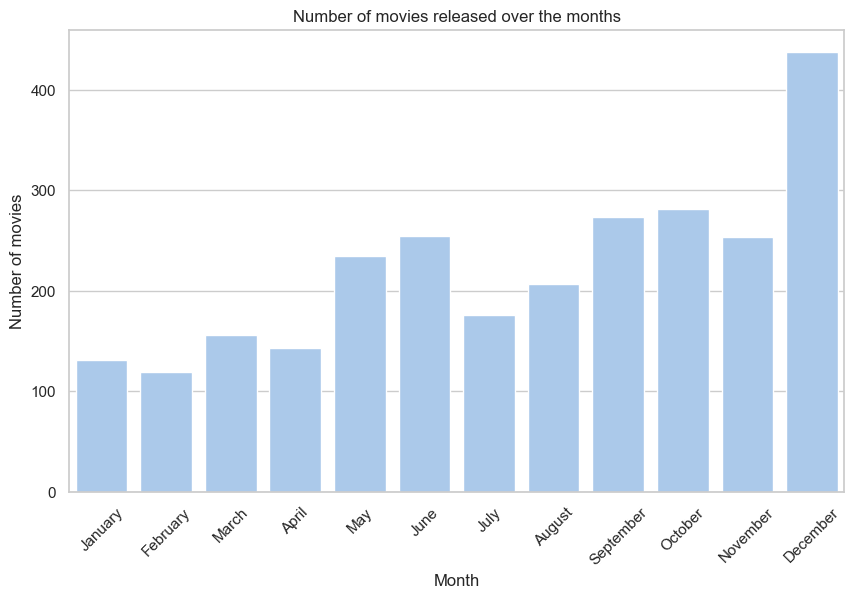  

The imbalanced distribution indicates that we can explore how timing poses an impact on the possibility of winning an Oscar. For example, why movies released in December are significantly more than in other months?  

### 2.2 Level I: Entry to Oscar selection
As a bright pearl in the film industry, the Oscar Prize favors only the most successful movies with profound thinking and artistic value. Due to the fierce competition for final awards, many good movies cannot eventually get the Oscar prize, but getting selected as Oscar candidates is also an amazing achievement. Therefore, directors holding films with aspirations for the Oscar awards want to ask, if an optimal release timing can help them to win in the Oscar selection more easily. Generally, we can inspect the ratios of selection in each month. To view the results more clearly, we run a k-means clustering for release months.  

From the graph, the optimal timings for entering Oscar selection are December and June, while movies released from January to April are harder to win the favor of the judges.

### 2.3 Level II: Oscar Winner
Do you know, that only **17.35%** nominated movies successfully take home Oscar awards! And thinking about the low selection ratio, winners need not only good quality films but also some good luck.  

If a director has produced a film expected to be highly praised and is confident that this movie can be selected for Oscar grading for sure, when is the optimal timing in this case? Is it the same as timing for Level I players? We investigated it by clustering the winning ratio in the Oscar selection dataset.  

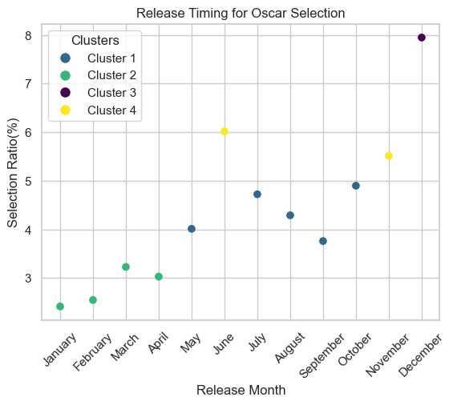  

The results reveal that the optimal timing is shifted to January and May, and December is now a very bad choice, only better than June and July.  

How does the winning probability change over the years?  

[Dynamic Graph: Oscar Probability over Years]  

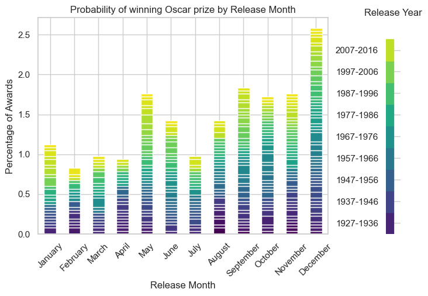

### 2.4 Confounders: Locations and Languages
Except for the timing, other factors may influence the winning probability as well. Here, we can take locations and languages into account.  

We first check their percentage in the selected movies dataset.  
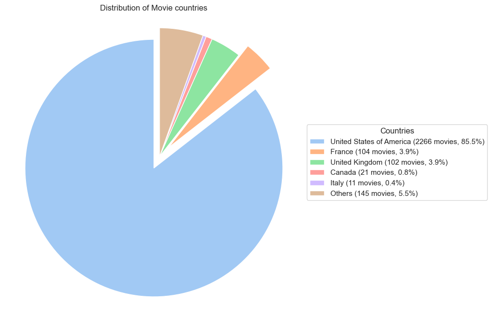
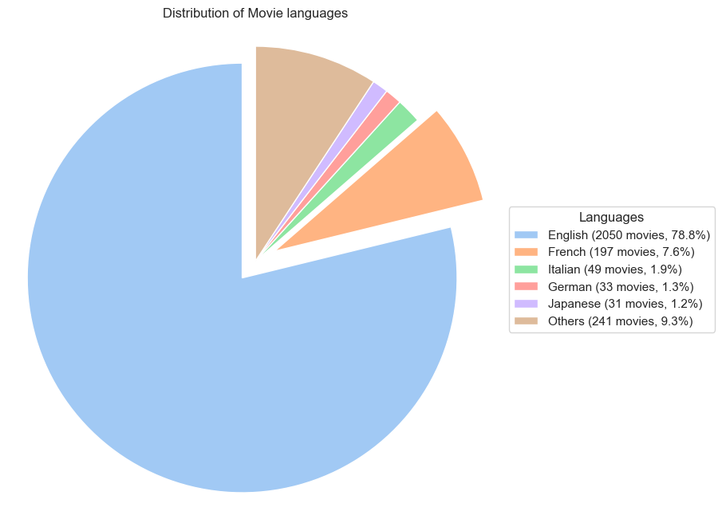

Then, for the winners:
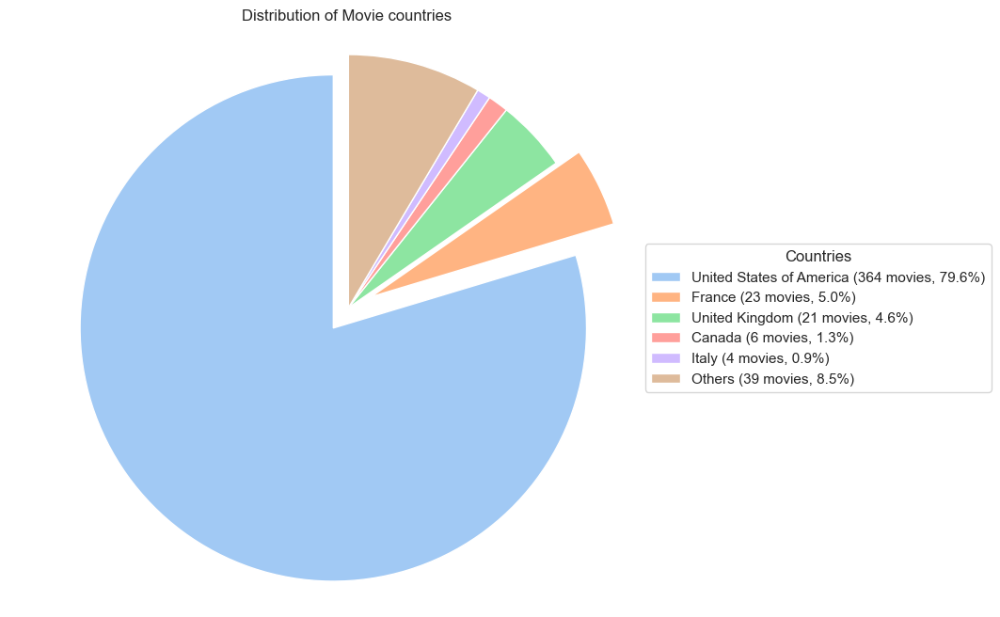
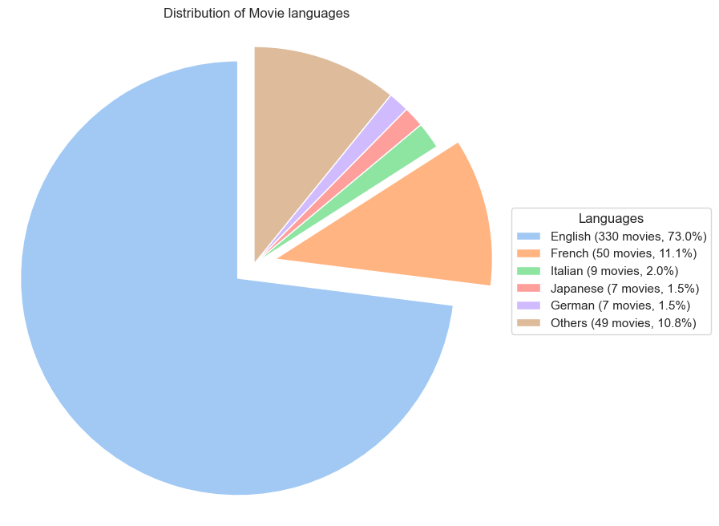

They show the phenomenon that US movies and English movies take a predominant majority because they are mostly overlapping. We therefore assume that the influence of languages can be covered in location influence. For simplicity, we convert the countries to continents. 

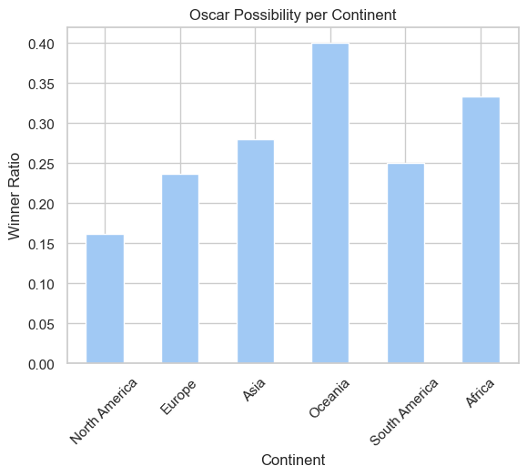

It presents that the most intense competition happens in North American movies. Even though their number is large in absolute value, it is never easy for them to win Oscar awards. In contrast, each Oceanian movie selected has a 40% winning probability.  

Based on this, we suggest that **common** North American directors, with the wish to win Oscar prizes, should generally consider releasing new movies in January and May. For **common** Australian directors, they should release the films in December and June.

As a detailed exploration, we run clustering on the continental subsets to evaluate the chance of winning an Oscar after the nomination. 

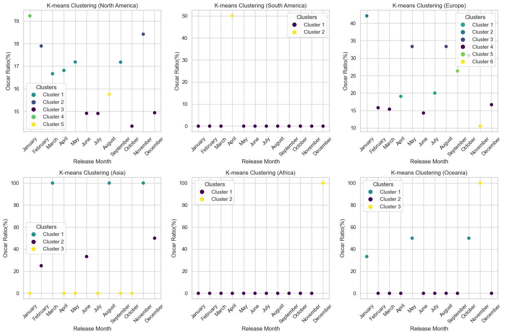

Then we can advise **successful directors** who promise to have Oscar-selected movies: 
- for American and European movies, the general suggestion in Level II  (January) still holds.
- despite the limited data, we are reluctant to say that, for Asian movies, the optimal timings are March, August, and November, while for Oceanian movies November is the only best time
- for African and South American movies, we cannot conclude anything without extra data.

Intuitively, this is shown in the heat map below.
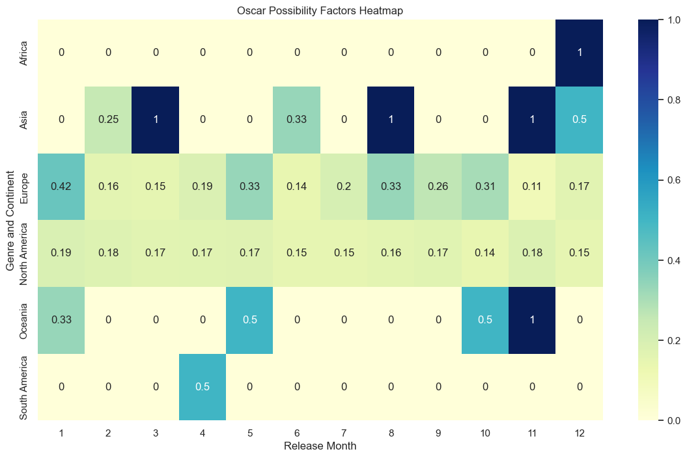

## 2.5 Box Office Revenue

To continue our analysis of research question 2, we now delve into the other factors impacting a movie's success. We start by looking at the box office revenue of the movies in our dataset. Our insight leads us to believe that higher box office revenues are correlated with a higher probability of winning an Oscar, which we will test via statistical analysis.  

Let us first plot the box office revenue of movies based on whether they received an Oscar or not.  

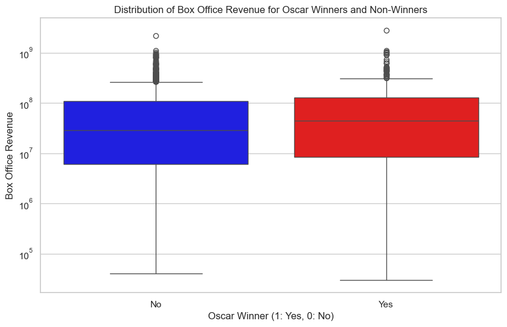

|                                   | Mean Box Office Revenue | Standard Deviation Box Office Revenue |
|-----------------------------------|------------------------|---------------------------------------|
| Oscar Winners                     | $141.49 million       | $274.32 million                       |
| Non-Winners                       | $94.29 million        | $164.44 million                       |
  

The difference in Mean Box Office Revenue between Winners and Non-Winners: <ins>$47.20 million</ins>.  

The analysis reveals that movies receiving Oscars tend to have higher average and median box office revenues compared to non-Oscar winners, with a significantly higher standard deviation indicating greater revenue variability. A Welch's t-test confirms a substantial difference, supported by a low p-value of 0.0005. Correlation analysis further indicates a positive correlation (coefficient of 0.09) between box office revenue and the number of Oscars won, with a p-value of 0.0005.

In summary, the statistical findings suggest a strong link between box office success and Oscar recognition. While the positive correlation underscores the influence of commercial success on receiving Oscars, it's important to note that Oscars don't guarantee a blockbuster, as evidenced by varied box office revenues for winners. This prompts further exploration into movie ratings to assess their correlation with the Oscars.

## 2.6 Ratings

We will now conduct a similar analysis to the one we performed for box office revenue, but this time for ratings. We will start by plotting the ratings of movies based on whether they received an Oscar or not.  

|                                   | Mean Vote | Standard Deviation Vote |
|-----------------------------------|-----------|-------------------------|
| Oscar Winners                     | 6.89       | 0.92                       |
| Non-Winners                       | 6.59       | 0.92                       |

The difference in Mean Average Vote between Winners and Non-Winners: <ins>0.29</ins>.  

The analysis demonstrates that Oscar-winning movies tend to have higher average and median ratings compared to non-Oscar winners, with a significantly higher standard deviation, indicating greater variability in ratings. A Welch's t-test confirms a substantial difference, supported by an extremely low p-value of 8.99e-09. Correlation analysis further indicates a positive correlation (coefficient of 0.12) between average ratings and the likelihood of winning an Oscar, with an extremely low p-value of 8.99e-09.  

In summary, the statistical findings suggest a strong link between average ratings and Oscar recognition. The t-test underscores the significant difference in average ratings for movies with and without Oscars, while the positive correlation emphasizes that higher average ratings increase the likelihood of winning Oscars. This highlights the importance of critical acclaim and audience appreciation in influencing industry recognition.  

Echoing the box office revenue analysis, these results emphasize the impact of a movie's success on its likelihood of receiving awards. However, it's crucial to acknowledge deviations, as movies with Oscars may receive low ratings and box office revenue, driven by artistic opinions influencing awards designations. Categories like documentaries or foreign films may deviate from traditional success metrics but still garner Oscars, showcasing the diverse nature of industry recognition.

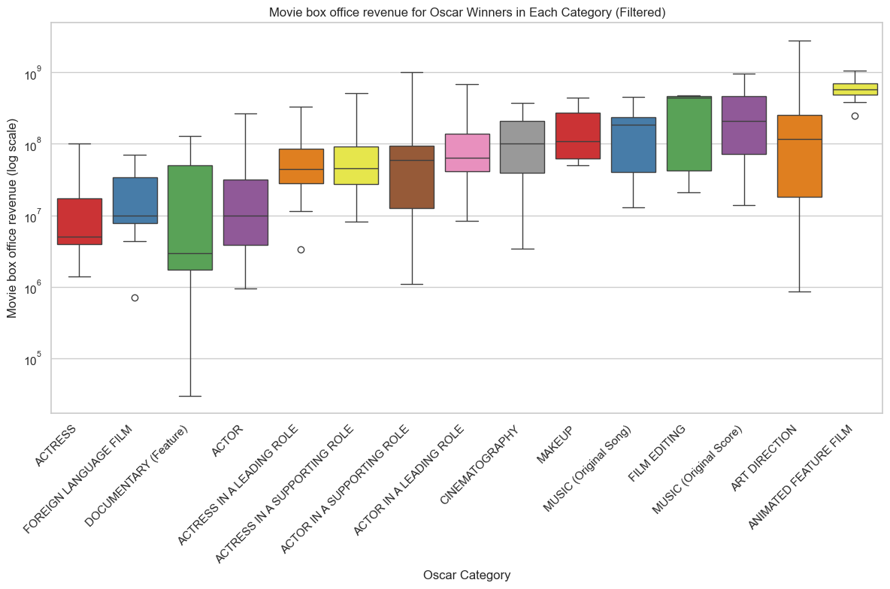
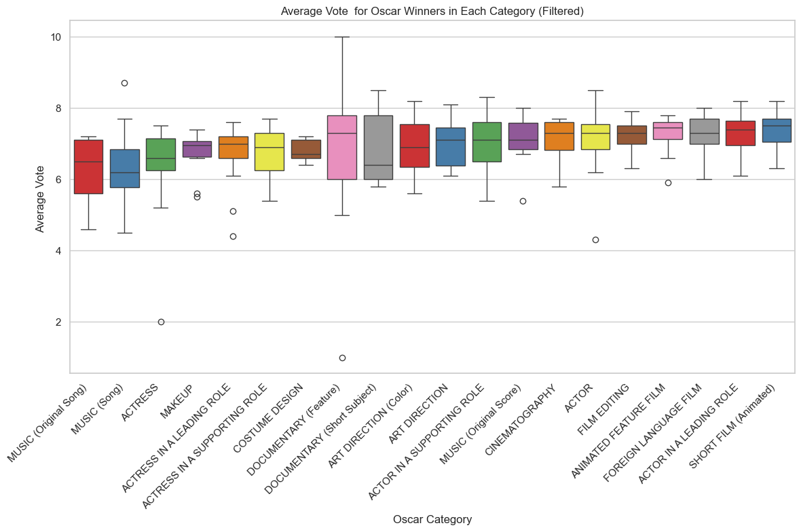

As we can see from the two box plots shown above, there is a significant difference in box office revenue and ratings between movies that received Oscars based on their category. Movies with Oscars such as Best Actress (in general) or Best Documentary generally received lower box office revenue and ratings than movies with Oscars such as Best Short Film or Actor. We also notice that the best documentary categories showcase an especially high variability in box office revenue and ratings, which is not the case for the best short film category. All these features indicate thus once again the biases that can be shown in the Oscars awards, which are not always correlated with the success of a movie, even though on a general basis, the Oscars are awarded to movies that have a higher box office revenue and ratings.  

#### **Conclusion:** 

USA is the country of most movies in the dataset, and the majority of movies are in English. While the correlation between release month and whether the movie wins an Oscar award is weak, release timing might still be a significant factor influencing the success of the movie. 

#### Transition :

Alright, film enthusiasts, brace yourselves for a bit of a reality check. Let's face it - are Oscar-winning movies always the ones we enjoy the most? Think about it. We know the superhero blockbusters aren't exactly Oscar bait, but come on, how good was the latest Spiderman? With that in mind, let's shift our focus from the glittering Oscars to the wider world of box office hits and audience favorites. After all, there's more to movie success than just golden statues.

_______________________________________________________________

# Box Office and ratings – Timing the Public's Pulse (Question 3)

As we continue our quest to discover if a movie's success can be timed, we now turn to the big question: how does the release timing impact a movie's box office success and public appeal? We're about to connect the dots between calendars, cash, and crowds. For this, we'll delve into the box office, which essentially measures the total revenue a movie earns from ticket sales. It's a fair assumption that the more people flock to see a movie, the more it resonates with the general public.

But that's not the only metric we're considering. We're also looking at how viewers rate movies, another crucial indicator of public opinion.

In this part, we will try to see how the release month of a movie influences its overall success and popularity. We'll examine this through various lenses – box office revenues, viewer votes, and ratings, while also considering how the quality of data documentation has evolved over the years. Let's dive into this multifaceted analysis and see what the numbers reveal about timing and movie success.

### 3.1. Ratings Versus Revenue – Does a "bad movie" makes less money than a "better" one ?
First, let's tackle the correlation between ratings and revenue. It seems intuitive that higher ratings should mean more money, right? Well, our data tells a more nuanced story. We'll explore why movies with mediocre ratings don't necessarily earn less, and how those with top ratings don't always hit the jackpot in terms of revenue. It's a complex equation where excellence in ratings doesn't always translate into box office gold.
### 3.2. Timing, Ratings, and Number of Votes – Searching for a Pattern
Next, we look at whether there's a link between when a movie is released, the ratings it receives, and how many people vote for it. Does a summer blockbuster get rated differently from a cozy winter flick? Can bad movies be popular, receiveing the attention of the public (represented by number of votes). Our findings might surprise you, as we unravel the (non)relationship between release months and how viewers rate these films.
### 3.3. Box Office Timing – Identifying the Lucrative times
#### 3.3.1. By Month – The Monthly Box Office Cycle
Let's break down the box office cycle month by month. We'll analyze which months are box office magnets, attracting audiences in droves, and which ones seem to be stuck in a cinematic slump. Our data suggests that not all months are created equal when it comes to raking in the revenue.
#### 3.3.2. By Season – The Seasonal Box Office Trends
Zooming out, we'll assess box office performance by season. Is summer really the blockbuster champion? Does winter bring more than just the holiday spirit to theaters? We'll see how each season stacks up in the race for box office success.

## 3.2. Timing, Ratings, and Number of Votes – Searching for a Pattern

#### Transition :
Small conclusion

_______________________________________________________________

# Conclusion

Summary, and conclusion.
<iframe src="assets/plot/distribution_ethnicity.html" width="750px" height="530px" frameborder="0" position="relative">Genre plot</iframe>

Deuxième : 

<iframe src="assets/plot/plot.html" width="750px" height="530px" frameborder="0" position="relative">Genre plot</iframe>
